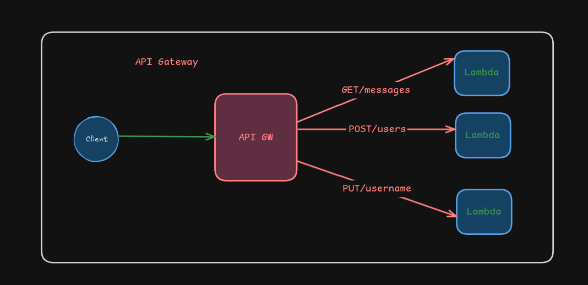

# Amazon API Gateway

O Amazon [API Gateway](https://aws.amazon.com/pt/api-gateway/) é um serviço da AWS que permite criar, publicar, manter, monitorar e proteger APIs em qualquer escala. Ele atua como uma "porta de entrada" para suas aplicações, permitindo que você crie APIs RESTful e WebSocket para se comunicar com serviços backend, como funções AWS Lambda, serviços HTTP, ou outros recursos da AWS.

### Principais Funcionalidades:

1. **Criação de APIs**: Permite definir endpoints, métodos HTTP (GET, POST, etc.), e integrações com backend.
2. **Segurança**: Suporta autenticação e autorização usando AWS IAM, Amazon Cognito, e outras soluções.
3. **Escalabilidade**: Gerencia automaticamente a escalabilidade para lidar com diferentes volumes de tráfego.
4. **Monitoramento**: Integra-se com o Amazon CloudWatch para monitorar métricas e logs.

### Benefícios do API Gateway:

- **Facilidade de Uso**: Simplifica a criação e gerenciamento de APIs.
- **Segurança**: Oferece várias opções de autenticação e autorização.
- **Escalabilidade**: Lida automaticamente com a escalabilidade.
- **Monitoramento e Logging**: Integração com CloudWatch para monitoramento e logs.

### Artigos Relacionados

- [Amazon API Gateway — Criando uma API e chamando uma função Lambda e AWS Step Functions — Criando meu primeiro workflow.](https://jvictor17.medium.com/amazon-api-gateway-criando-uma-api-e-chamando-uma-fun%C3%A7%C3%A3o-lambda-e-aws-step-functions-criando-915f72f2cefb)
- [Amazon API Gateway, Main Features and Core Concepts](https://medium.com/aws-lambda-serverless-developer-guide-with-hands/amazon-api-gateway-main-features-and-core-concepts-980e8cadef09)
- [What are an API and Amazon API Gateway? Creating and Using a REST API with Amazon API Gateway.](https://cmakkaya.medium.com/what-is-an-api-and-the-amazon-api-gateway-creating-and-using-a-rest-api-with-amazon-api-gateway-d1b42cbb1037)

