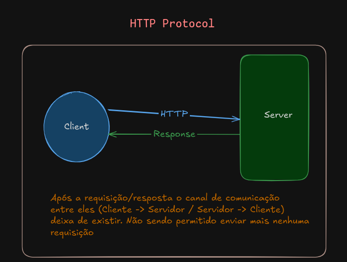
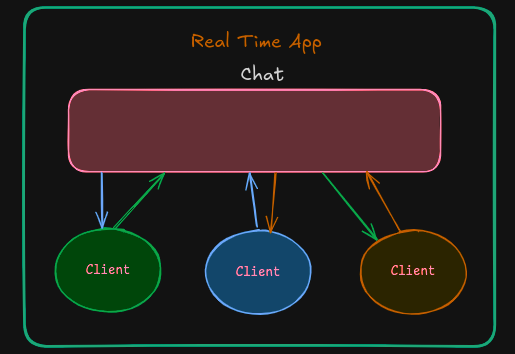
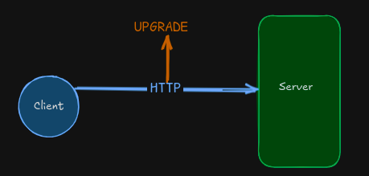
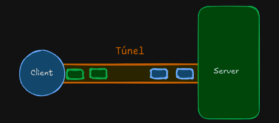
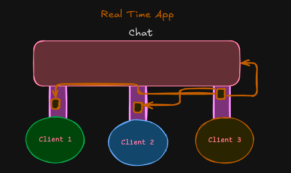
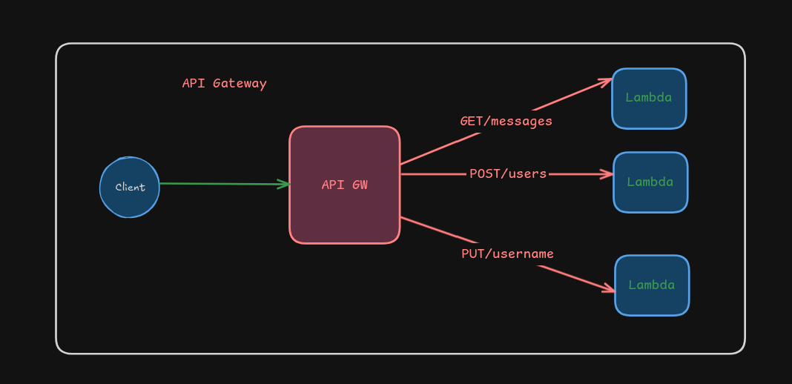
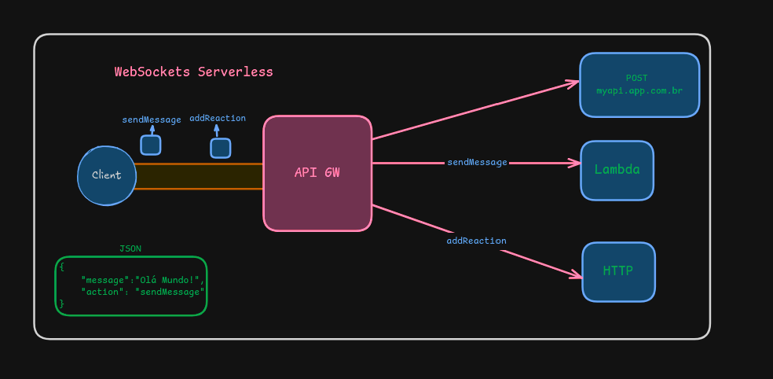

# O que são WebSockets & Como trabalhar com eles

## Contexto

- Para entender sobre WebSockets precisamos entender primeiro sobre o **HTTP Protocol**



Isso funciona para quase todos os casos, porem não e viável para todos, vou utilizar o exemplo de um chat



Inviável a utilização do método HTTP pela forma como ele é, o Cliente realizando a requisição, e o servidor apenas aguardando receber as mensagens 

> [!NOTE] Long Polling
> Há uma soluçao utilizando o metodo HTTP, chamada de Long Polling. 
resumidamente uma "regra" no cliente realizando a consulta da API
nesse caso verificando se existem novas mensagem, onde o usuario estaria 
recebendo em tempo real. 

```
setInterval(() => {
    await api.getMessages();
}, 2000)
```

### Long Polling, é uma abordagem ruim?

Depende da aplicação, nesse caso de chat, definitivamente não, pois querendo ou não WebSockets trazem mais complexidades e não são leves

Exemplo de uso: Em uma plataforma de vídeo, ao realizar o uploads dos vídeos para um serviço de terceiros no e possível utilizar webhooks que
notifica o processo do upload (start, in progress, finish)

nesse caso seria interessante utilizar o long polling para ficar de (2; 5; 10) segundos na API verificando o status desse upload

E não teria que alterar praticamente nada em comparação ao WebSocket onde é necessário realizar uma refatoração tanto no cliente quanto no servidor

### Contras Long Polling

1. Ainda continua sendo uma Requisição HTTP, consequentemente a chamada não será tao rápida, variando de acordo com o intervalo pré definido anteriormente.
2.  Performance, Abrindo e fechando conexão a todo e qualquer momento.
3. Sobrecarga, no exemplo demonstrei apenas 3 clients realizando chamadas, se previamente foi definido a chamada na API a cada 1 segundo todos os clientes irão realizar 180 (60 * 3) chamadas na API por minuto. A depender do porte da aplicação será bem mais, podendo gerar custos indesejáveis

## O que sao WebSockets

Agora sim partindo para um dos topicos principais,o que sao os WebSockets

Funciona semelhante a requisiçao HTTP




> [!NOTE] Conexão 
> Na conexão Client -> Server, e enviado no header uma solicitação de Upgrade na request, que e um upgrade de protocolo. Dada uma resposta positiva é criado um Túnel de comunicação bilateral




> [!NOTE] Túnel
> Com o túnel de conexão aberto, e possível enviar e receber quantas informações forem necessárias sem ter que gerar novas requisições para o servidor No exemplo do APP de chat utilizando o HTTP, o cliente solicita a cada 2 segundos a chamada na API para verificar se houveram novas mensagens. Já com o Túnel aberto o servidor sem a necessidade do client realizar uma nova conexao, notifica que novas mensagens foram enviadas. Tendo assim a comuniçao Bilateral




> [!NOTE] Fluxo
> Cliente envia uma mensagem, vai para o servidor via HTTP || Tunel. O servidor realiza o cadastro no banco de dados e já envia para os outros Clientes sem a necessidade de realizar a chamada novamente na API para verificar se existem ou não novas mensagens

## Como utilizá-los 

Nesse projeto eu utilizei via [[Amazon API Gateway]]. Mas existem varias formas de utilizá-los 
em um resumo geral as API gateways funcionam assim



E tem suporte nativamente para o uso de WebSockets, entao basta alterar os metodos HTTP's para WebSockets (E possivel utilizar ambos em uma mesma API)




## Artigos Relacionados

- [The WebSocket API (WebSockets)](https://developer.mozilla.org/en-US/docs/Web/API/WebSockets_API)
- [WebSocket: O que é e como usar ?](https://www.rocketseat.com.br/blog/artigos/post/web-socket-o-que-e-e-como-usar)
- [Mastering Real-Time Communication: A Comprehensive WebSocket Tutorial](https://medium.com/@sergey.dudik/mastering-real-time-communication-a-comprehensive-websocket-tutorial-0f6cf384d1e8)
